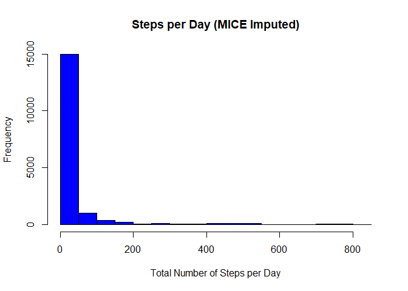

## Loading and preprocessing the data

```r
data<-read.csv("activity.csv")
head(data)
```

```
##   steps       date interval
## 1    NA 2012-10-01        0
## 2    NA 2012-10-01        5
## 3    NA 2012-10-01       10
## 4    NA 2012-10-01       15
## 5    NA 2012-10-01       20
## 6    NA 2012-10-01       25
```

```r
str(data)
```

```
## 'data.frame':	17568 obs. of  3 variables:
##  $ steps   : int  NA NA NA NA NA NA NA NA NA NA ...
##  $ date    : chr  "2012-10-01" "2012-10-01" "2012-10-01" "2012-10-01" ...
##  $ interval: int  0 5 10 15 20 25 30 35 40 45 ...
```

```r
summary(data)
```

```
##      steps            date              interval     
##  Min.   :  0.00   Length:17568       Min.   :   0.0  
##  1st Qu.:  0.00   Class :character   1st Qu.: 588.8  
##  Median :  0.00   Mode  :character   Median :1177.5  
##  Mean   : 37.38                      Mean   :1177.5  
##  3rd Qu.: 12.00                      3rd Qu.:1766.2  
##  Max.   :806.00                      Max.   :2355.0  
##  NA's   :2304
```

#data$date<-as.Date(data$date)
#data$date<-transform(data, date=as.Date(date))


## What is mean total number of steps taken per day?

```r
require(dplyr) #needed for summarize command
```

```
## Loading required package: dplyr
```

```
## 
## Attaching package: 'dplyr'
```

```
## The following objects are masked from 'package:stats':
## 
##     filter, lag
```

```
## The following objects are masked from 'package:base':
## 
##     intersect, setdiff, setequal, union
```

```r
agg_data<-summarize(group_by(data,date),steps=sum(steps))
agg_data<-transform(agg_data, date=factor(date))


head(agg_data)
```

```
##         date steps
## 1 2012-10-01    NA
## 2 2012-10-02   126
## 3 2012-10-03 11352
## 4 2012-10-04 12116
## 5 2012-10-05 13294
## 6 2012-10-06 15420
```

```r
hist(agg_data$steps,main="Steps per Day",xlab="Total Number of Steps per Day",ylim = c(0,30),col="orange")
```

<!-- -->

```r
#see mean and median
summary(agg_data)
```

```
##          date        steps      
##  2012-10-01: 1   Min.   :   41  
##  2012-10-02: 1   1st Qu.: 8841  
##  2012-10-03: 1   Median :10765  
##  2012-10-04: 1   Mean   :10766  
##  2012-10-05: 1   3rd Qu.:13294  
##  2012-10-06: 1   Max.   :21194  
##  (Other)   :55   NA's   :8
```

```r
#alternative way to see mean and median
mean(agg_data$steps,na.rm = T)
```

```
## [1] 10766.19
```

```r
median(agg_data$steps,na.rm = T)
```

```
## [1] 10765
```

## What is the average daily activity pattern?

```r
mean_data<-summarize(group_by(data,interval),steps=mean(steps,na.rm=T))
with(mean_data,plot(interval,steps, type="l"))
```

<!-- -->

```r
#which interval has max steps
mean_data[which.max(mean_data$steps),]
```

```
## # A tibble: 1 x 2
##   interval steps
##      <int> <dbl>
## 1      835  206.
```


## Imputing missing values

```r
install.packages("mice",repos = "http://cran.us.r-project.org")
```

```
## Installing package into 'C:/Users/Notebook/Documents/R/win-library/4.0'
## (as 'lib' is unspecified)
```

```
## package 'mice' successfully unpacked and MD5 sums checked
```

```
## Warning: cannot remove prior installation of package 'mice'
```

```
## Warning in file.copy(savedcopy, lib, recursive = TRUE): problem copying C:
## \Users\Notebook\Documents\R\win-library\4.0\00LOCK\mice\libs\x64\mice.dll to C:
## \Users\Notebook\Documents\R\win-library\4.0\mice\libs\x64\mice.dll: Permission
## denied
```

```
## Warning: restored 'mice'
```

```
## 
## The downloaded binary packages are in
## 	C:\Users\Notebook\AppData\Local\Temp\RtmpuQnHgq\downloaded_packages
```

```r
library(mice)
```

```
## 
## Attaching package: 'mice'
```

```
## The following object is masked from 'package:stats':
## 
##     filter
```

```
## The following objects are masked from 'package:base':
## 
##     cbind, rbind
```

```r
#impute using random sample from subject's entire observed measurements. Most reasonable imputation. generate 1 dataset from 500 iterations.
datat<-data
imp<- mice(data = datat, m = 1, method = c("sample","",""), maxit = 500)
```

```
## 
##  iter imp variable
##   1   1  steps
##   2   1  steps
##   3   1  steps
##   4   1  steps
##   5   1  steps
##   6   1  steps
##   7   1  steps
##   8   1  steps
##   9   1  steps
##   10   1  steps
##   11   1  steps
##   12   1  steps
##   13   1  steps
##   14   1  steps
##   15   1  steps
##   16   1  steps
##   17   1  steps
##   18   1  steps
##   19   1  steps
##   20   1  steps
##   21   1  steps
##   22   1  steps
##   23   1  steps
##   24   1  steps
##   25   1  steps
##   26   1  steps
##   27   1  steps
##   28   1  steps
##   29   1  steps
##   30   1  steps
##   31   1  steps
##   32   1  steps
##   33   1  steps
##   34   1  steps
##   35   1  steps
##   36   1  steps
##   37   1  steps
##   38   1  steps
##   39   1  steps
##   40   1  steps
##   41   1  steps
##   42   1  steps
##   43   1  steps
##   44   1  steps
##   45   1  steps
##   46   1  steps
##   47   1  steps
##   48   1  steps
##   49   1  steps
##   50   1  steps
##   51   1  steps
##   52   1  steps
##   53   1  steps
##   54   1  steps
##   55   1  steps
##   56   1  steps
##   57   1  steps
##   58   1  steps
##   59   1  steps
##   60   1  steps
##   61   1  steps
##   62   1  steps
##   63   1  steps
##   64   1  steps
##   65   1  steps
##   66   1  steps
##   67   1  steps
##   68   1  steps
##   69   1  steps
##   70   1  steps
##   71   1  steps
##   72   1  steps
##   73   1  steps
##   74   1  steps
##   75   1  steps
##   76   1  steps
##   77   1  steps
##   78   1  steps
##   79   1  steps
##   80   1  steps
##   81   1  steps
##   82   1  steps
##   83   1  steps
##   84   1  steps
##   85   1  steps
##   86   1  steps
##   87   1  steps
##   88   1  steps
##   89   1  steps
##   90   1  steps
##   91   1  steps
##   92   1  steps
##   93   1  steps
##   94   1  steps
##   95   1  steps
##   96   1  steps
##   97   1  steps
##   98   1  steps
##   99   1  steps
##   100   1  steps
##   101   1  steps
##   102   1  steps
##   103   1  steps
##   104   1  steps
##   105   1  steps
##   106   1  steps
##   107   1  steps
##   108   1  steps
##   109   1  steps
##   110   1  steps
##   111   1  steps
##   112   1  steps
##   113   1  steps
##   114   1  steps
##   115   1  steps
##   116   1  steps
##   117   1  steps
##   118   1  steps
##   119   1  steps
##   120   1  steps
##   121   1  steps
##   122   1  steps
##   123   1  steps
##   124   1  steps
##   125   1  steps
##   126   1  steps
##   127   1  steps
##   128   1  steps
##   129   1  steps
##   130   1  steps
##   131   1  steps
##   132   1  steps
##   133   1  steps
##   134   1  steps
##   135   1  steps
##   136   1  steps
##   137   1  steps
##   138   1  steps
##   139   1  steps
##   140   1  steps
##   141   1  steps
##   142   1  steps
##   143   1  steps
##   144   1  steps
##   145   1  steps
##   146   1  steps
##   147   1  steps
##   148   1  steps
##   149   1  steps
##   150   1  steps
##   151   1  steps
##   152   1  steps
##   153   1  steps
##   154   1  steps
##   155   1  steps
##   156   1  steps
##   157   1  steps
##   158   1  steps
##   159   1  steps
##   160   1  steps
##   161   1  steps
##   162   1  steps
##   163   1  steps
##   164   1  steps
##   165   1  steps
##   166   1  steps
##   167   1  steps
##   168   1  steps
##   169   1  steps
##   170   1  steps
##   171   1  steps
##   172   1  steps
##   173   1  steps
##   174   1  steps
##   175   1  steps
##   176   1  steps
##   177   1  steps
##   178   1  steps
##   179   1  steps
##   180   1  steps
##   181   1  steps
##   182   1  steps
##   183   1  steps
##   184   1  steps
##   185   1  steps
##   186   1  steps
##   187   1  steps
##   188   1  steps
##   189   1  steps
##   190   1  steps
##   191   1  steps
##   192   1  steps
##   193   1  steps
##   194   1  steps
##   195   1  steps
##   196   1  steps
##   197   1  steps
##   198   1  steps
##   199   1  steps
##   200   1  steps
##   201   1  steps
##   202   1  steps
##   203   1  steps
##   204   1  steps
##   205   1  steps
##   206   1  steps
##   207   1  steps
##   208   1  steps
##   209   1  steps
##   210   1  steps
##   211   1  steps
##   212   1  steps
##   213   1  steps
##   214   1  steps
##   215   1  steps
##   216   1  steps
##   217   1  steps
##   218   1  steps
##   219   1  steps
##   220   1  steps
##   221   1  steps
##   222   1  steps
##   223   1  steps
##   224   1  steps
##   225   1  steps
##   226   1  steps
##   227   1  steps
##   228   1  steps
##   229   1  steps
##   230   1  steps
##   231   1  steps
##   232   1  steps
##   233   1  steps
##   234   1  steps
##   235   1  steps
##   236   1  steps
##   237   1  steps
##   238   1  steps
##   239   1  steps
##   240   1  steps
##   241   1  steps
##   242   1  steps
##   243   1  steps
##   244   1  steps
##   245   1  steps
##   246   1  steps
##   247   1  steps
##   248   1  steps
##   249   1  steps
##   250   1  steps
##   251   1  steps
##   252   1  steps
##   253   1  steps
##   254   1  steps
##   255   1  steps
##   256   1  steps
##   257   1  steps
##   258   1  steps
##   259   1  steps
##   260   1  steps
##   261   1  steps
##   262   1  steps
##   263   1  steps
##   264   1  steps
##   265   1  steps
##   266   1  steps
##   267   1  steps
##   268   1  steps
##   269   1  steps
##   270   1  steps
##   271   1  steps
##   272   1  steps
##   273   1  steps
##   274   1  steps
##   275   1  steps
##   276   1  steps
##   277   1  steps
##   278   1  steps
##   279   1  steps
##   280   1  steps
##   281   1  steps
##   282   1  steps
##   283   1  steps
##   284   1  steps
##   285   1  steps
##   286   1  steps
##   287   1  steps
##   288   1  steps
##   289   1  steps
##   290   1  steps
##   291   1  steps
##   292   1  steps
##   293   1  steps
##   294   1  steps
##   295   1  steps
##   296   1  steps
##   297   1  steps
##   298   1  steps
##   299   1  steps
##   300   1  steps
##   301   1  steps
##   302   1  steps
##   303   1  steps
##   304   1  steps
##   305   1  steps
##   306   1  steps
##   307   1  steps
##   308   1  steps
##   309   1  steps
##   310   1  steps
##   311   1  steps
##   312   1  steps
##   313   1  steps
##   314   1  steps
##   315   1  steps
##   316   1  steps
##   317   1  steps
##   318   1  steps
##   319   1  steps
##   320   1  steps
##   321   1  steps
##   322   1  steps
##   323   1  steps
##   324   1  steps
##   325   1  steps
##   326   1  steps
##   327   1  steps
##   328   1  steps
##   329   1  steps
##   330   1  steps
##   331   1  steps
##   332   1  steps
##   333   1  steps
##   334   1  steps
##   335   1  steps
##   336   1  steps
##   337   1  steps
##   338   1  steps
##   339   1  steps
##   340   1  steps
##   341   1  steps
##   342   1  steps
##   343   1  steps
##   344   1  steps
##   345   1  steps
##   346   1  steps
##   347   1  steps
##   348   1  steps
##   349   1  steps
##   350   1  steps
##   351   1  steps
##   352   1  steps
##   353   1  steps
##   354   1  steps
##   355   1  steps
##   356   1  steps
##   357   1  steps
##   358   1  steps
##   359   1  steps
##   360   1  steps
##   361   1  steps
##   362   1  steps
##   363   1  steps
##   364   1  steps
##   365   1  steps
##   366   1  steps
##   367   1  steps
##   368   1  steps
##   369   1  steps
##   370   1  steps
##   371   1  steps
##   372   1  steps
##   373   1  steps
##   374   1  steps
##   375   1  steps
##   376   1  steps
##   377   1  steps
##   378   1  steps
##   379   1  steps
##   380   1  steps
##   381   1  steps
##   382   1  steps
##   383   1  steps
##   384   1  steps
##   385   1  steps
##   386   1  steps
##   387   1  steps
##   388   1  steps
##   389   1  steps
##   390   1  steps
##   391   1  steps
##   392   1  steps
##   393   1  steps
##   394   1  steps
##   395   1  steps
##   396   1  steps
##   397   1  steps
##   398   1  steps
##   399   1  steps
##   400   1  steps
##   401   1  steps
##   402   1  steps
##   403   1  steps
##   404   1  steps
##   405   1  steps
##   406   1  steps
##   407   1  steps
##   408   1  steps
##   409   1  steps
##   410   1  steps
##   411   1  steps
##   412   1  steps
##   413   1  steps
##   414   1  steps
##   415   1  steps
##   416   1  steps
##   417   1  steps
##   418   1  steps
##   419   1  steps
##   420   1  steps
##   421   1  steps
##   422   1  steps
##   423   1  steps
##   424   1  steps
##   425   1  steps
##   426   1  steps
##   427   1  steps
##   428   1  steps
##   429   1  steps
##   430   1  steps
##   431   1  steps
##   432   1  steps
##   433   1  steps
##   434   1  steps
##   435   1  steps
##   436   1  steps
##   437   1  steps
##   438   1  steps
##   439   1  steps
##   440   1  steps
##   441   1  steps
##   442   1  steps
##   443   1  steps
##   444   1  steps
##   445   1  steps
##   446   1  steps
##   447   1  steps
##   448   1  steps
##   449   1  steps
##   450   1  steps
##   451   1  steps
##   452   1  steps
##   453   1  steps
##   454   1  steps
##   455   1  steps
##   456   1  steps
##   457   1  steps
##   458   1  steps
##   459   1  steps
##   460   1  steps
##   461   1  steps
##   462   1  steps
##   463   1  steps
##   464   1  steps
##   465   1  steps
##   466   1  steps
##   467   1  steps
##   468   1  steps
##   469   1  steps
##   470   1  steps
##   471   1  steps
##   472   1  steps
##   473   1  steps
##   474   1  steps
##   475   1  steps
##   476   1  steps
##   477   1  steps
##   478   1  steps
##   479   1  steps
##   480   1  steps
##   481   1  steps
##   482   1  steps
##   483   1  steps
##   484   1  steps
##   485   1  steps
##   486   1  steps
##   487   1  steps
##   488   1  steps
##   489   1  steps
##   490   1  steps
##   491   1  steps
##   492   1  steps
##   493   1  steps
##   494   1  steps
##   495   1  steps
##   496   1  steps
##   497   1  steps
##   498   1  steps
##   499   1  steps
##   500   1  steps
```

```
## Warning: Number of logged events: 1
```

```r
data_comp <- complete(imp)

agg_data_comp<-summarize(group_by(data_comp,date),steps=sum(steps))
#agg_data<-transform(agg_data, date=factor(date))
hist(data_comp$steps,main="Steps per Day (MICE Imputed)",xlab="Total Number of Steps per Day", col="blue")
```

<!-- -->


```r
install.packages("VIM",repos = "http://cran.us.r-project.org")
```

```
## Installing package into 'C:/Users/Notebook/Documents/R/win-library/4.0'
## (as 'lib' is unspecified)
```

```
## package 'VIM' successfully unpacked and MD5 sums checked
```

```
## Warning: cannot remove prior installation of package 'VIM'
```

```
## Warning in file.copy(savedcopy, lib, recursive = TRUE): problem copying C:
## \Users\Notebook\Documents\R\win-library\4.0\00LOCK\VIM\libs\x64\VIM.dll to C:
## \Users\Notebook\Documents\R\win-library\4.0\VIM\libs\x64\VIM.dll: Permission
## denied
```

```
## Warning: restored 'VIM'
```

```
## 
## The downloaded binary packages are in
## 	C:\Users\Notebook\AppData\Local\Temp\RtmpuQnHgq\downloaded_packages
```

```r
library("VIM")
```

```
## Loading required package: colorspace
```

```
## Loading required package: grid
```

```
## VIM is ready to use.
```

```
## Suggestions and bug-reports can be submitted at: https://github.com/statistikat/VIM/issues
```

```
## 
## Attaching package: 'VIM'
```

```
## The following object is masked from 'package:datasets':
## 
##     sleep
```

```r
#impute using k-nearest neighbor (KNN)- this is akin to taking the average of the interval in which there is an NA.Less reasonable imputation method considering the non-NAs could be mere outliers. random sampling from entire available [observed] population of steps is more sound. 
imp2<-kNN(datat, variable = c("steps"))
agg_imp2<-summarize(group_by(imp2,date),steps=sum(steps))
#agg_data<-transform(agg_data, date=factor(date))
hist(agg_imp2$steps,main="Steps per Day (KNN Imputed)",xlab="Total Number of Steps per Day", col="blue",ylim=c(0,30))
```

<!-- -->


## Are there differences in activity patterns between weekdays and weekends?

```r
#pull days from imp2$date and if they are either 0 or 6 then it is a weekend, else it is a weekday. store in new col 'day'
imp2$day <- ifelse(as.POSIXlt(imp2$date)$wday %in% c(0,6), 'weekend', 'weekday')
agg_imp2_day<-summarize(group_by(imp2,interval,day),steps=mean(steps))
```

```
## `summarise()` has grouped output by 'interval'. You can override using the `.groups` argument.
```

```r
library(ggplot2)
g<-ggplot(agg_imp2_day,aes(interval,steps))
g+geom_line() + facet_grid(day~.) + ggtitle(expression("Activity Patterns between Weekdays and Weekends"))
```

<!-- -->
